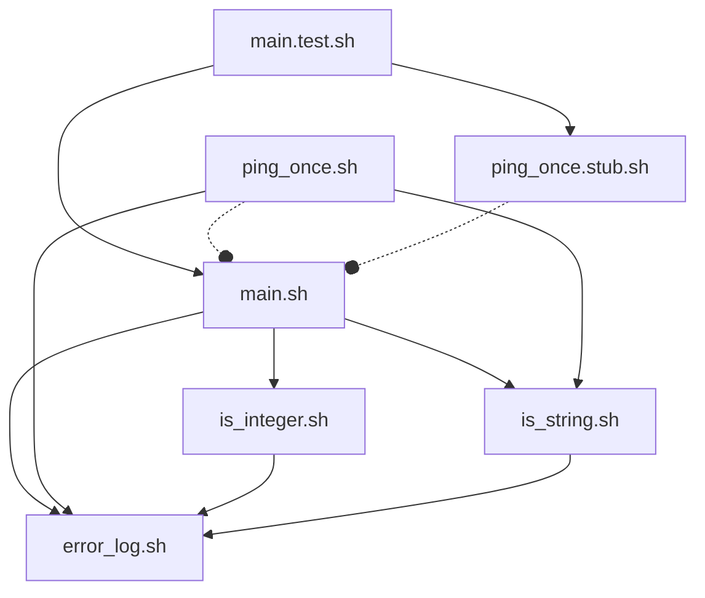

# overview

シェルスクリプトでの構造化方法を模索したもの。

## UML

--> 依存方向  
-.-o 依存注入

```mermaid
flowchart TD
    main.test.sh --> main.sh
    main.test.sh --> ping_once.stub.sh
 
    ping_once.sh -.-o main.sh
    ping_once.stub.sh -.-o main.sh

    main.sh --> is_integer.sh
    main.sh --> is_string.sh
    main.sh --> error_log.sh

    ping_once.sh --> is_string.sh
    ping_once.sh --> error_log.sh
 
    is_integer.sh --> error_log.sh
    is_string.sh --> error_log.sh
```

